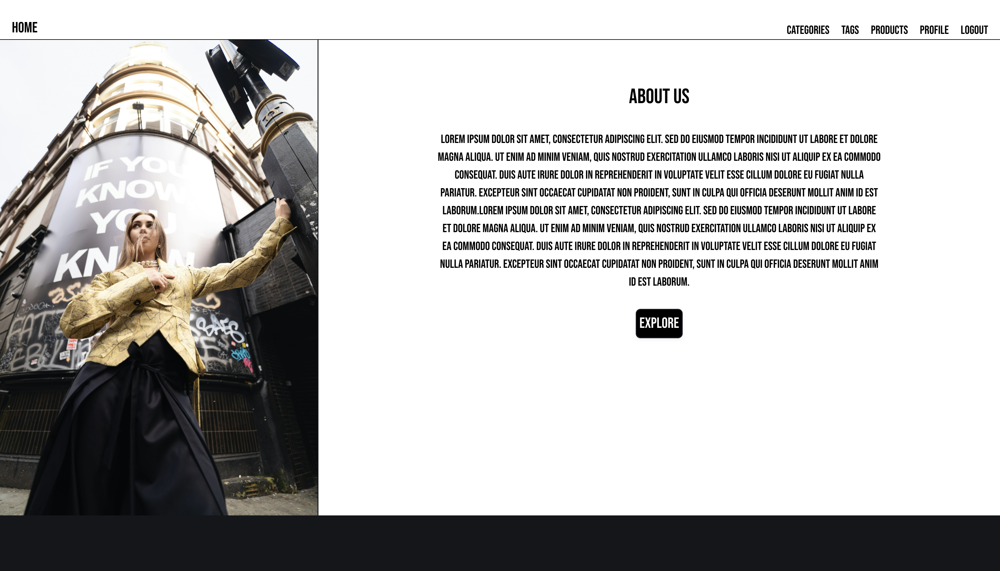
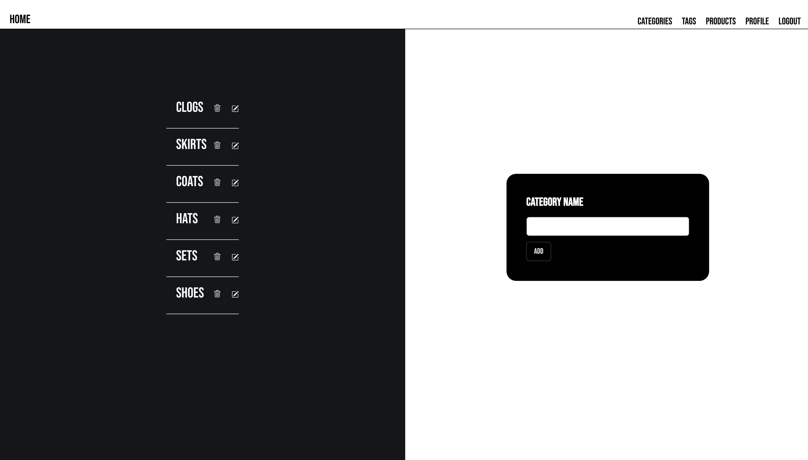
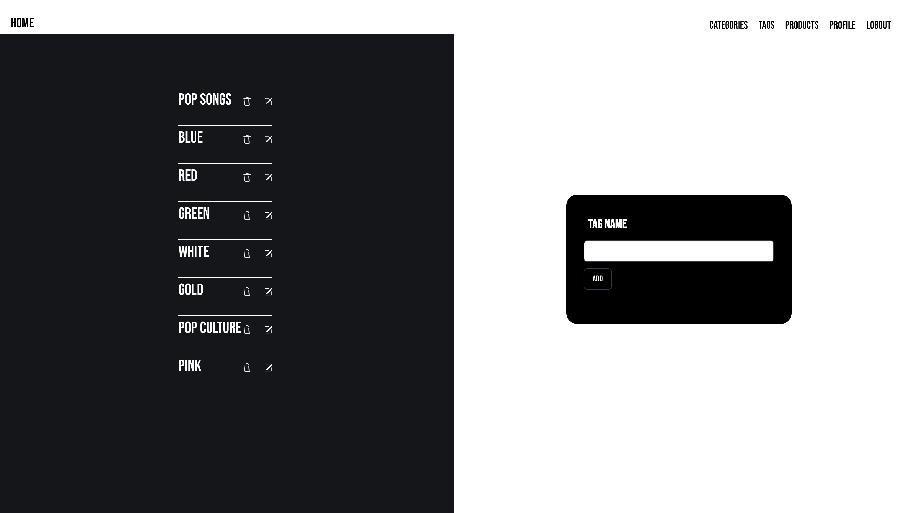
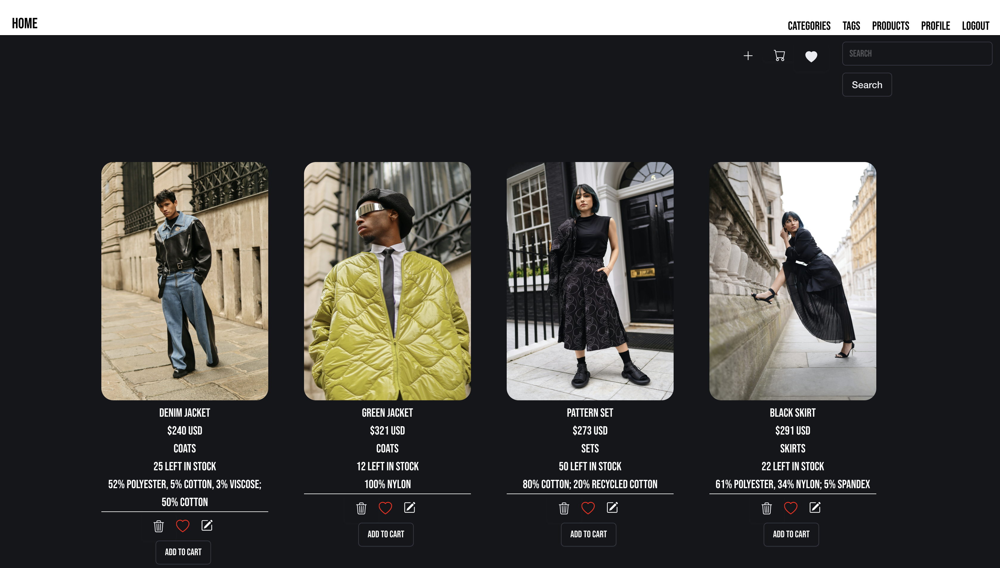
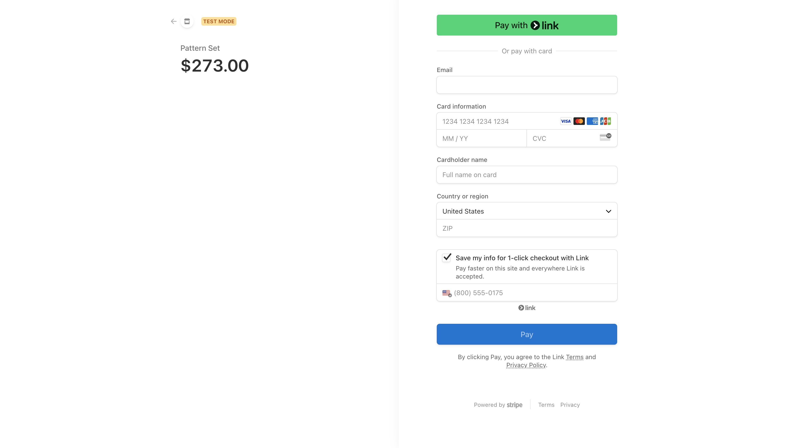
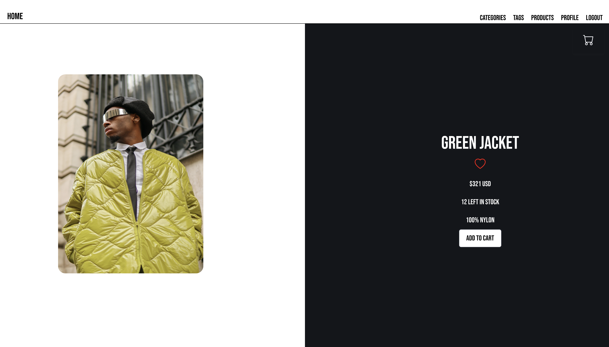

# E-Commerce-Refactor

## Table of Contents

* [Introduction](#introduction)
* [Features](#features)
* [Installation](#installation)
* [Technologies Used](#technologies-used)
* [Usage](#usage)
* [Screenshots](#screenshots)
* [Future Developments](#future-developments)
* [Contact](#contact)
* [Contributions](#contributions)
* [License](#license)
* [Demo](#demo)

## Introduction

This website features a previous E-Commerce backend project that utilizes Object Relational Mapping as well as SQL to manage its database with a RESTful API to manipulate it. This project builds upon this by providing a front-end to allow users to interact with it  more meaningfully and seamlessly.

## Features

* React library to create a maintainable, seemless userinterface for a command-line application.
* Express to produce an RESTful API.
* User authentication for secure access.
* Ability for users to favorite products, add them to a cart, and make purchases.

## Installation

This project locally by following these steps:

1. Clone the repository to your local machine.
2. Install the necessary dependencies by running npm install.
3. Seed database by running npm run seed.
3. Start the application by running npm run develop in your terminal.

## Technologies Used

* Express
* SQL
* Axios
* Bootstrap
* Bootstrap Icons
* React
* CSS Animations
* Stripe
* local Storage

## Usage

* Navigate to the homepage and authenticate by providing correct credentials.
* Identify the navigation bar and links, including tag, category, product, profile, and logout.
* Navigate to the products on the homepage or click the explore button to navigate to the product page.
* Click on a product to see its individual product page. Add that product to your cart or add to favorites by clicking the heart button.
* Navigate to the Tag and Category Page to view, add, update, or delete a tag or category.
* Click the product link located in the navigation bar.
* Explore the list of products along with their details.
* Add, update, or delete a product.
* Search for a product with the search bar at the far-right corner. Click your result to be navigated to its individual product page.
* Click the heart button at the right corner to view favorites.
* Click the cart button to view products added to your cart. Click cancel to exit, delete to remove a product, or checkout to purchase the product(s).
* Navigate to the profile page to view your information and update or delete your account.
* Click the logout link in the navigation bar to log out.

## Screenshots

### Image of Homepage

### Second Half of Home page

### Category Page

### Tag Page

### Products Page

### Checkout Page 

### Individual Product Page

## Future Developments

* Add role based functionality, so only admin users are able to manage data.
* Add further scalability.
* Add further styling to search results.
* Add ability to see purchased products and user information in profile page.

## Contact

If there are any questions or feedback, feel free to reach out via: 

* Github Issues: [Github](http://Github.com/Taylor-Brandon)

* Email: [Email](mailto://taylorbrandon.dev@gmail.com)

## Contributions

Special thanks to Columbia Bootcamps for providing the educational resources necessary to complete this project.

## License

## Demo

Navigate to demo: [Here](https://drive.google.com/file/d/1V0Vxly3IyO8eZUMAHmNn1O7AVIK9bo3D/view?usp=drive_link)